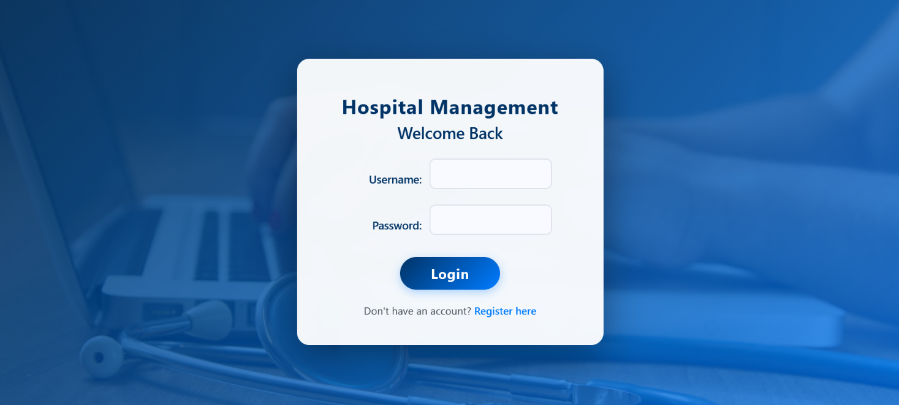
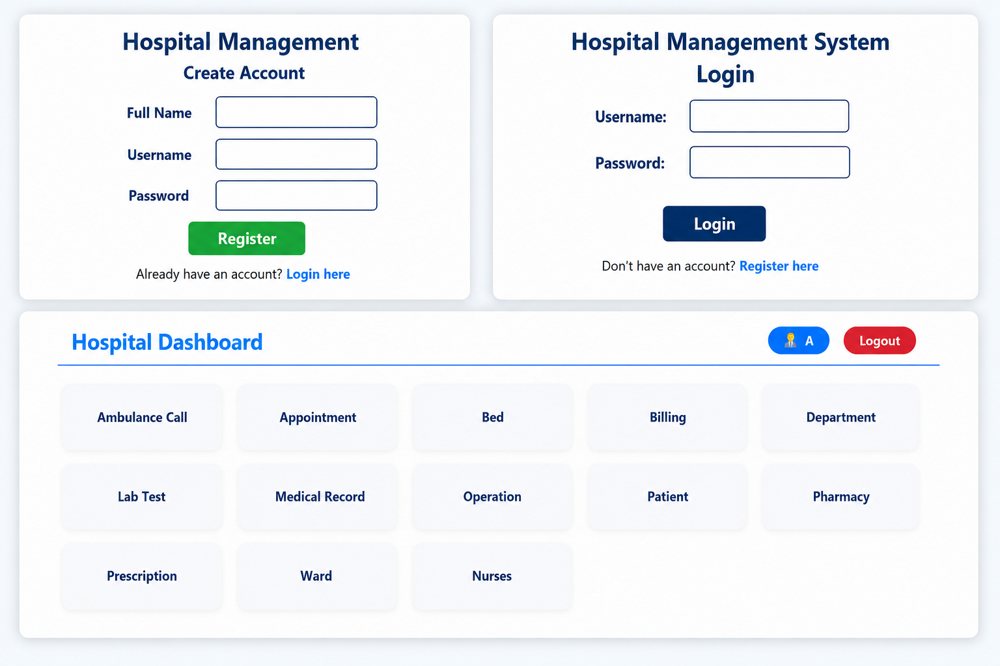
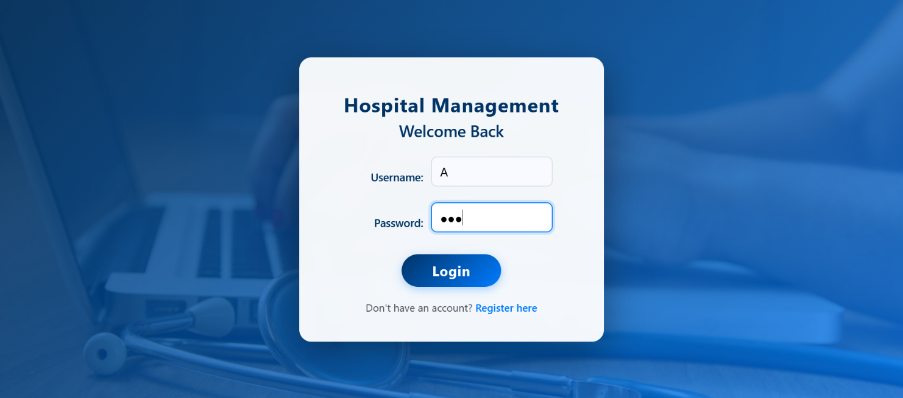
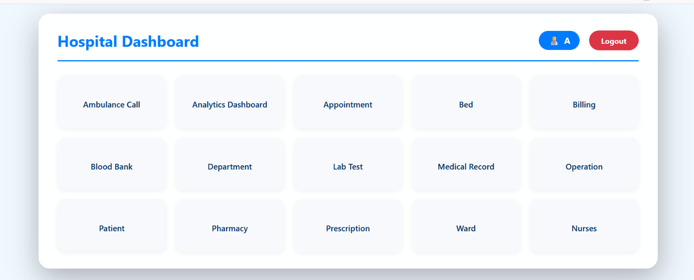

# 🏥 Hospital Management System (HMS)

<div align="center">

## 🏥 Complete Hospital Management System

### A Web-Based Hospital Management Solution Built with PHP & MySQL

**Patient Management • Doctor Management • Appointments • Billing • Laboratory • Pharmacy • Blood Bank • Ambulance • Bed Management • Medical Records • Analytics**

</div>

---

## 📌 About the Project

**Hospital Management System (HMS)** is a complete web-based application developed to manage and organize the daily operations of a hospital from a single centralized platform.

The system is designed to reduce manual work, improve data organization, maintain relationships between different hospital departments, and provide administrators and staff with an easy-to-use management interface.

The application connects multiple hospital operations through a relational database.

For example:

```text
Patient
   │
   ├── Appointment ───────► Doctor
   │
   ├── Medical Record ────► Doctor
   │
   ├── Laboratory Test ───► Doctor
   │
   ├── Prescription ──────► Doctor
   │
   ├── Billing
   │
   ├── Bed ───────────────► Ward
   │
   ├── Operation ─────────► Doctor
   │
   └── Insurance
```

---

# 🎯 Project Objectives

The main objectives of this project are:

* To create a centralized hospital management system.
* To reduce manual data management.
* To store hospital information in a structured relational database.
* To manage patient information efficiently.
* To manage doctors and hospital departments.
* To simplify appointment scheduling.
* To manage patient billing and payments.
* To manage wards and beds.
* To maintain laboratory test records.
* To store patient medical records.
* To manage prescriptions and medicines.
* To manage pharmacy information.
* To manage blood donors and blood requests.
* To manage ambulance services.
* To manage nurses and staff.
* To provide analytics and visual reports.
* To maintain relationships between different hospital modules.

---

# ✨ Main Features

## 🔐 Authentication & User Management

* User registration
* User login
* Secure password hashing
* Session management
* Logout
* Role-based access
* Admin user management
* User deletion
* User role modification

### Available Roles

```text
Admin
User
Doctor
Staff
Nurse
```

---

## 👤 Patient Management

The Patient Management module stores and manages complete patient information.

### Patient Information

* Patient ID
* Full Name
* Date of Birth
* Gender
* Contact Number
* Email
* Address
* Blood Group
* Medical History
* Emergency Contact
* Patient Status
* Registration Date

### Features

* Add patient
* View patients
* Search patients
* Edit patient
* Delete patient
* Track patient status
* Store medical history
* Store emergency contact
* Automatically record registration date

### Patient Status

```text
Active
Discharged
```

---

# 👨‍⚕️ Doctor Management

The Doctor Management module is used to manage all doctors working in the hospital.

### Doctor Information

* Doctor ID
* Name
* Specialization
* Department
* Contact
* Email
* Qualification
* Experience
* Schedule
* Consultation Fee
* Availability
* Joining Date

### Features

* Add doctor
* Edit doctor
* Delete doctor
* Assign department
* Manage availability
* Manage doctor schedule
* Store consultation fee
* Track doctor information

---

# 🏢 Department Management

The Department module manages different hospital departments.

### Department Information

* Department ID
* Department Name
* Head Doctor
* Floor
* Contact
* Description
* Creation Date

### Features

* Add department
* Edit department
* Delete department
* Assign head doctor
* Manage department details

### Example Departments

```text
Cardiology
Neurology
Orthopedics
Pediatrics
Dermatology
Emergency
ICU
General Medicine
```

---

# 📅 Appointment Management

The Appointment module manages patient appointments with doctors.

### Appointment Information

* Appointment ID
* Patient
* Doctor
* Appointment Date
* Appointment Time
* Purpose
* Status
* Notes
* Created Date
* Updated Date

### Appointment Status

```text
Scheduled
Completed
Cancelled
```

### Features

* Create appointment
* Update appointment
* Cancel appointment
* Assign patient
* Assign doctor
* Select date and time
* Add appointment purpose
* Add notes
* Track appointment status

### Automatic Patient Creation

If a patient name is entered that does not exist in the database, the system can automatically create a new patient record.

### Workflow

```text
Patient
   ↓
Select Doctor
   ↓
Select Date & Time
   ↓
Enter Purpose
   ↓
Create Appointment
   ↓
Scheduled
   ↓
Completed / Cancelled
```

---

# 💳 Billing Management

The Billing module manages hospital bills and patient payments.

### Billing Information

* Bill ID
* Patient
* Appointment
* Bill Date
* Total Amount
* Paid Amount
* Payment Method
* Payment Status
* Insurance Claim ID
* Created Date

### Payment Methods

```text
Cash
Card
bKash
```

### Payment Status

```text
Paid
Unpaid
```

### Features

* Create bill
* Edit bill
* Delete bill
* View bill
* Track total amount
* Track paid amount
* Track payment status
* Connect billing with appointments

---

# 🚑 Ambulance Management

The Ambulance module manages hospital ambulance vehicles and ambulance calls.

## 🚑 Ambulance Information

* Ambulance ID
* Vehicle Number
* Ambulance Type
* Driver Name
* Driver Contact
* Status
* Current Location
* Created Date

## 📞 Ambulance Call Information

* Call ID
* Patient
* Ambulance
* Call Date
* Call Time
* Pickup Location
* Drop-off Location
* Status

### Call Status

```text
Pending
In Progress
Completed
Cancelled
```

### Workflow

```text
Ambulance Request
       ↓
Patient Information
       ↓
Pickup Location
       ↓
Assign Ambulance
       ↓
Trip Started
       ↓
Drop-off
       ↓
Completed
```

---

# 🏥 Ward Management

The Ward Management module manages hospital wards and their capacity.

### Ward Information

* Ward ID
* Ward Number
* Ward Type
* Floor
* Capacity
* Current Occupancy
* Status
* Created Date

### Ward Types

```text
General
Private
ICU
Emergency
```

### Ward Status

```text
Available
Full
```

### Features

* Add ward
* Edit ward
* Delete ward
* Manage ward capacity
* Track current occupancy
* Track ward status

---

# 🛏️ Bed Management

The Bed Management module manages individual hospital beds.

### Bed Information

* Bed ID
* Ward
* Bed Number
* Status
* Patient
* Admission Date
* Discharge Date

### Features

* Add bed
* Assign bed to patient
* Change bed status
* Record admission
* Record discharge
* View available beds
* Manage occupied beds

### Relationship

```text
Ward
  │
  ├── Bed 01
  ├── Bed 02
  ├── Bed 03
  ├── Bed 04
  └── Bed 05
```

A bed can optionally be assigned to a patient.

---

# 🧪 Laboratory Test Management

The Laboratory module manages patient laboratory tests.

### Test Information

* Test ID
* Patient
* Doctor
* Test Type
* Test Date
* Results
* Status
* Cost
* Created Date

### Test Status

```text
Pending
In Progress
Completed
Cancelled
```

### Features

* Create laboratory test
* Assign patient
* Assign doctor
* Add test type
* Add test results
* Track test cost
* Update test status

---

# 📋 Medical Record Management

The Medical Record module stores important patient medical information.

### Medical Record Information

* Record ID
* Patient
* Doctor
* Diagnosis
* Treatment
* Notes
* Follow-up Date
* Status
* Created Date

### Record Status

```text
Active
Resolved
Chronic
Follow-up Required
```

### Features

* Add diagnosis
* Add treatment
* Add medical notes
* Assign doctor
* Set follow-up date
* Track medical record status

---

# 🔬 Operation & Surgery Management

The Operation module manages surgical procedures.

### Operation Information

* Operation ID
* Patient
* Doctor
* Operation Date
* Operation Time
* Operation Type
* Operation Room
* Status
* Notes

### Operation Status

```text
Scheduled
In Progress
Completed
Cancelled
```

### Features

* Schedule operation
* Assign patient
* Assign doctor
* Assign operation room
* Track operation status
* Add operation notes

---

# 💊 Prescription Management

The Prescription module manages prescriptions created for patients.

### Prescription Information

* Prescription ID
* Patient
* Doctor
* Appointment
* Prescription Date
* Diagnosis
* Notes
* Status

### Prescription Status

```text
Completed
Cancelled
```

### Features

* Create prescription
* Assign patient
* Assign doctor
* Link appointment
* Add diagnosis
* Add notes
* Add medicines
* Add dosage
* Add frequency
* Add duration
* Add instructions

---

# 💊 Medicine Management

The Medicine module manages hospital medicine inventory.

### Medicine Information

* Medicine ID
* Medicine Name
* Category
* Manufacturer
* Batch Number
* Expiry Date
* Price
* Quantity
* Unit
* Pharmacy
* Supplier
* Created Date

### Features

* Add medicine
* Edit medicine
* Delete medicine
* Track quantity
* Track price
* Track expiry date
* Track manufacturer
* Track supplier
* Link medicine with pharmacy

---

# 🏪 Pharmacy Management

The Pharmacy module manages hospital pharmacy branches.

### Pharmacy Information

* Pharmacy ID
* Pharmacy Name
* Location
* Contact
* Email
* Working Hours
* Pharmacist Name
* Created Date

### Features

* Add pharmacy
* Edit pharmacy
* Delete pharmacy
* Manage pharmacy information
* Assign medicines to pharmacy

---

# 🩸 Blood Bank Management

The Blood Bank module is divided into two major sections:

```text
Donors
Requests
```

---

## 🧑 Blood Donor Management

### Donor Information

* Donor ID
* Name
* Blood Group
* Contact
* Phone
* Email
* Address
* District
* Last Donation Date
* Status
* Created Date

### Donor Status

```text
Active
Inactive
```

### Features

* Register donor
* Edit donor
* Delete donor
* Search donor
* Search by blood group
* Store district
* Track last donation date

---

## 🩸 Blood Request Management

### Request Information

* Request ID
* Patient Name
* Blood Group
* Quantity
* Hospital
* District
* Contact
* Phone
* Request Date
* Status
* Notes
* Created Date

### Request Status

```text
Pending
Fulfilled
Cancelled
```

### Features

* Create blood request
* Update request
* Cancel request
* Track request status
* Search blood group
* Store hospital information
* Store district information

---

## 📊 Blood Stock Dashboard

The system provides a blood-group-based overview.

### Supported Blood Groups

```text
A+
A-
B+
B-
AB+
AB-
O+
O-
```

### Additional Features

* Blood group filtering
* Donor count
* District autocomplete
* Phone number validation
* Donor status tracking

---

# 👩‍⚕️ Nurse & Staff Management

The Staff/Nurse module manages hospital employees.

### Staff Information

* Staff ID
* Name
* Role
* Department
* Contact
* Email
* Shift
* Joining Date
* Salary
* Status

### Shift Options

```text
Morning
Evening
Night
```

### Features

* Add staff
* Edit staff
* Delete staff
* Assign department
* Manage shifts
* Store salary
* Track employment status

---

# 🛡️ Insurance Management

The Insurance module stores patient insurance information.

### Insurance Information

* Insurance ID
* Patient
* Provider
* Policy Number
* Coverage Type
* Coverage Amount
* Start Date
* Expiry Date
* Status
* Created Date

### Possible Future Features

```text
Claim Submission
Claim Approval
Claim Rejection
Claim Tracking
Insurance Billing
```

---

# 📊 Analytics Dashboard

The Analytics Dashboard provides a visual overview of hospital activities.

### Technology Used

```text
Chart.js
JavaScript
PHP
MySQL
```

---

## 📌 KPI Cards

The dashboard can display:

```text
Total Patients
Total Doctors
Total Nurses
Total Revenue
Pending Lab Tests
Today's Appointments
Bed Occupancy %
Today's Revenue
```

---

## 🔎 Analytics Filters

Users can filter information by:

* Date Range
* Department
* Doctor
* Appointment Status
* Laboratory Status
* Ward
* Blood Group
* Patient Search

---

## 📈 Analytics Charts

### 1. Daily Patient Registration

Shows patient registration trends over time.

### 2. Monthly Revenue

Shows monthly hospital revenue.

### 3. Appointment Status

Displays:

```text
Scheduled
Completed
Cancelled
```

### 4. Laboratory Status

Displays:

```text
Pending
In Progress
Completed
Cancelled
```

### 5. Doctors by Department

Shows the number of doctors working in each department.

### 6. Patient Gender Ratio

Displays the distribution of patients by gender.

---

# 🕒 Recent Activities

The Analytics Dashboard also provides a recent activity section.

It can display:

* Recent patient registrations
* Recent appointments
* Recent billing activities

This helps administrators quickly understand recent hospital activities.

---

# 🔗 System Relationships

The major modules are interconnected.

```text
                    ┌─────────────┐
                    │    USERS    │
                    └──────┬──────┘
                           │
                           ▼
                    ┌─────────────┐
                    │  DASHBOARD  │
                    └──────┬──────┘
                           │
       ┌───────────────────┼───────────────────┐
       │                   │                   │
       ▼                   ▼                   ▼
   PATIENT              DOCTOR            DEPARTMENT
       │                   │
       └──────────┬────────┘
                  ▼
            APPOINTMENT
                  │
        ┌─────────┼──────────┐
        │         │          │
        ▼         ▼          ▼
     BILLING    LAB TEST  PRESCRIPTION
        │         │          │
        │         │          ▼
        │         │       MEDICINE
        │         │          │
        │         │          ▼
        │         │       PHARMACY
        │         │
        ▼         ▼
    INSURANCE  MEDICAL RECORD
                  │
                  ▼
              OPERATION

PATIENT
   │
   └────────► BED ─────────► WARD

PATIENT
   │
   └────────► AMBULANCE CALL ─────────► AMBULANCE

BLOOD DONOR
   │
   └────────► BLOOD BANK ◄──────── BLOOD REQUEST

STAFF
   │
   └────────► DEPARTMENT
```

---

# 🗄️ Database Schema

The system uses a relational MySQL/MariaDB database.

### Main Database Tables

```text
users
patient
doctor
department
appointment
billing
ambulance_call
ambulance
ward
bed
labtest
medicalrecord
operation
prescription
prescription_medicine
medicine
pharmacy
blood_donor
blood_request
staff
insurance
```

---

# 🔗 Foreign Key Relationships

Important relationships include:

```text
appointment.patient_id
        ↓
patient.patient_id
```

```text
appointment.doctor_id
        ↓
doctor.doctor_id
```

```text
doctor.dept_id
        ↓
department.dept_id
```

```text
billing.patient_id
        ↓
patient.patient_id
```

```text
billing.appointment_id
        ↓
appointment.appointment_id
```

```text
bed.ward_id
        ↓
ward.ward_id
```

```text
bed.patient_id
        ↓
patient.patient_id
```

```text
labtest.patient_id
        ↓
patient.patient_id
```

```text
labtest.doctor_id
        ↓
doctor.doctor_id
```

```text
medicalrecord.patient_id
        ↓
patient.patient_id
```

```text
medicalrecord.doctor_id
        ↓
doctor.doctor_id
```

```text
operation.patient_id
        ↓
patient.patient_id
```

```text
operation.doctor_id
        ↓
doctor.doctor_id
```

```text
prescription.patient_id
        ↓
patient.patient_id
```

```text
prescription.doctor_id
        ↓
doctor.doctor_id
```

```text
prescription.appointment_id
        ↓
appointment.appointment_id
```

```text
prescription_medicine.prescription_id
        ↓
prescription.prescription_id
```

```text
prescription_medicine.medicine_id
        ↓
medicine.medicine_id
```

```text
medicine.pharmacy_id
        ↓
pharmacy.pharmacy_id
```

```text
insurance.patient_id
        ↓
patient.patient_id
```

```text
ambulance_call.patient_id
        ↓
patient.patient_id
```

```text
ambulance_call.ambulance_id
        ↓
ambulance.ambulance_id
```

These relationships help maintain **referential integrity** and prevent invalid relationships between records.

---

# 🛠️ Technology Stack

| Layer               | Technology         |
| ------------------- | ------------------ |
| Backend             | PHP                |
| Programming Style   | Procedural PHP     |
| Database            | MySQL / MariaDB    |
| Frontend            | HTML5              |
| Styling             | CSS3               |
| Client-side         | JavaScript         |
| Charts              | Chart.js           |
| Icons               | Font Awesome       |
| Web Server          | Apache             |
| Local Server        | XAMPP              |
| Database Management | phpMyAdmin         |
| Code Editor         | Visual Studio Code |

---

# 📂 Project Structure

```text
Hospital-Management-System/
│
├── config.php
│
├── login.php
├── register.php
├── logout.php
├── user.php
├── dashboard.php
│
├── patient.php
├── doctor.php
├── department.php
├── appointment.php
├── billing.php
│
├── ambulance.php
├── ambulance_call.php
│
├── ward.php
├── bed.php
│
├── labtest.php
├── medicalrecord.php
├── operation.php
│
├── prescription.php
├── medicine.php
├── pharmacy.php
│
├── blood_bank.php
├── nurse.php
├── insurance.php
│
├── analytics_dashboard.php
│
├── hms.sql
│
├── 1.png
├── 2.png
├── 3.png
└── 4.png
```

---

# 📄 File-by-File Description

| File                      | Purpose                               |
| ------------------------- | ------------------------------------- |
| `config.php`              | Database connection and configuration |
| `login.php`               | User login                            |
| `register.php`            | User registration                     |
| `logout.php`              | Logout and session termination        |
| `user.php`                | User and role management              |
| `dashboard.php`           | Main dashboard                        |
| `patient.php`             | Patient CRUD                          |
| `doctor.php`              | Doctor CRUD                           |
| `department.php`          | Department management                 |
| `appointment.php`         | Appointment management                |
| `billing.php`             | Billing and payment management        |
| `ambulance.php`           | Ambulance management                  |
| `ambulance_call.php`      | Ambulance call management             |
| `ward.php`                | Ward management                       |
| `bed.php`                 | Bed allocation                        |
| `labtest.php`             | Laboratory test management            |
| `medicalrecord.php`       | Medical records                       |
| `operation.php`           | Operation/surgery management          |
| `prescription.php`        | Prescription management               |
| `medicine.php`            | Medicine inventory                    |
| `pharmacy.php`            | Pharmacy management                   |
| `blood_bank.php`          | Blood donor and request management    |
| `nurse.php`               | Nurse/staff management                |
| `insurance.php`           | Insurance information                 |
| `analytics_dashboard.php` | Analytics and reporting               |
| `hms.sql`                 | Complete database structure           |

---

# ⚙️ Installation & Setup

## Step 1 — Clone the Repository

```bash
git clone https://github.com/Mahin01234/Database-Management-System-Lab-Project.git
```

Or download the repository as a ZIP file.

---

## Step 2 — Move Project to XAMPP

Copy the project folder into:

```text
C:\xampp\htdocs\
```

Example:

```text
C:\xampp\htdocs\Hospital-Management-System\
```

---

## Step 3 — Start XAMPP

Open **XAMPP Control Panel**.

Start:

```text
Apache
MySQL
```

---

## Step 4 — Create Database

Open:

```text
http://localhost/phpmyadmin
```

Create a database named:

```text
hms
```

---

## Step 5 — Import Database

Inside phpMyAdmin:

```text
hms
   ↓
Import
   ↓
Choose hms.sql
   ↓
Go
```

The required tables will be created automatically.

---

## Step 6 — Configure Database

Open:

```text
config.php
```

Configure your database connection.

Example:

```php
$host = "localhost";
$user = "root";
$password = "";
$database = "hms";
$port = 3306;
```

Change these values if your local MySQL configuration is different.

---

## Step 7 — Run the Application

Open your browser:

```text
http://localhost/Hospital-Management-System/login.php
```

If your folder has a different name, replace it accordingly.

---

# 🔑 Default Login

The default account may be:

```text
Username: admin
Password: admin
```

If the default credentials do not work, check the `users` table inside the `hms` database.

> ⚠️ For security purposes, change the default password before deploying the system to a real server.

---

# 🖥️ How the System Works

A typical hospital workflow can look like this:

```text
1. User Login
      ↓
2. Dashboard
      ↓
3. Register Patient
      ↓
4. Select Doctor
      ↓
5. Schedule Appointment
      ↓
6. Perform Consultation
      ↓
7. Create Medical Record
      ↓
8. Request Laboratory Test
      ↓
9. Create Prescription
      ↓
10. Generate Bill
      ↓
11. Assign Bed if Required
      ↓
12. Operation if Required
      ↓
13. Discharge Patient
      ↓
14. Analytics & Reports
```

---

# 📋 Current Feature List

| Module          | Implemented Features                                    |
| --------------- | ------------------------------------------------------- |
| Authentication  | Login, Registration, Password Hashing, Sessions         |
| User Management | User List, Role Management, Delete User                 |
| Patient         | Add, Edit, Delete, View, Medical History                |
| Doctor          | CRUD, Specialization, Department, Availability          |
| Department      | CRUD, Head Doctor, Floor, Contact                       |
| Appointment     | Schedule, Update, Cancel, Patient/Doctor Linking        |
| Billing         | Bill Creation, Payment Tracking, Payment Methods        |
| Ambulance       | Ambulance Records, Call Logs, Status                    |
| Ward            | Ward CRUD, Capacity, Occupancy                          |
| Bed             | Bed Allocation, Patient Assignment, Admission/Discharge |
| Laboratory      | Test Records, Results, Cost, Status                     |
| Medical Records | Diagnosis, Treatment, Notes, Follow-up                  |
| Operations      | Surgery Scheduling, Room, Status                        |
| Prescription    | Prescription Creation, Diagnosis, Medicine              |
| Pharmacy        | Pharmacy Branch Management                              |
| Medicine        | Medicine Information, Quantity, Expiry, Price           |
| Blood Bank      | Donors, Requests, Blood Stock                           |
| Nurse/Staff     | Staff, Department, Shift, Salary                        |
| Insurance       | Patient Insurance Information                           |
| Analytics       | KPIs, Charts, Filters, Recent Activities                |

---

# 🚀 Future Improvements & Features

The current system already provides many core hospital-management features, but it can be extended into a more advanced production-ready platform.

---

## 📱 1. Patient Portal

Create a separate portal for patients.

Patients could:

* Register/login.
* View their profile.
* View appointments.
* Book appointments.
* Cancel appointments.
* View medical records.
* View prescriptions.
* View laboratory results.
* View bills.
* View payment history.
* Download reports.

---

## 📅 2. Online Appointment Booking

Allow patients to book appointments online.

### Possible workflow:

```text
Patient
   ↓
Select Department
   ↓
Select Doctor
   ↓
View Available Slots
   ↓
Select Date & Time
   ↓
Book Appointment
   ↓
Admin/Doctor Approval
   ↓
Appointment Confirmed
```

---

## 🔔 3. Appointment Reminder System

Send automatic reminders before appointments.

### Notification methods:

```text
Email
SMS
WhatsApp
Push Notification
```

Example:

```text
Your appointment with Dr. Rahman
is scheduled for tomorrow at 10:30 AM.
```

---

## 📆 4. Doctor Schedule Calendar

Create a visual calendar for doctors.

Features:

* Available time slots
* Unavailable time slots
* Doctor leave
* Appointment calendar
* Conflict detection
* Automatic slot blocking

---

## 💊 5. Advanced Pharmacy Inventory

Improve medicine inventory with:

* Low-stock alerts
* Expiry alerts
* Reorder levels
* Purchase orders
* Supplier management
* Stock-in
* Stock-out
* Inventory history
* Batch tracking

Example:

```text
Paracetamol
Stock: 15
Minimum Level: 20

⚠️ Low Stock
```

---

## 🧪 6. Laboratory Barcode System

Introduce barcode-based laboratory management.

### Workflow:

```text
Test Requested
     ↓
Generate Sample ID
     ↓
Generate Barcode
     ↓
Attach Barcode to Sample
     ↓
Scan Sample
     ↓
Update Test Status
     ↓
Enter Results
     ↓
Generate Report
```

---

## 📄 7. PDF Report Generation

Generate downloadable PDF documents.

Possible PDFs:

* Patient report
* Prescription
* Medical record
* Laboratory report
* Billing invoice
* Discharge summary
* Blood request report
* Appointment report

---

## 📊 8. Advanced Reporting

Add reports such as:

```text
Daily Patient Report
Monthly Patient Report
Revenue Report
Doctor Performance Report
Department Report
Laboratory Report
Pharmacy Report
Blood Bank Report
Bed Occupancy Report
Appointment Report
```

---

## 📥 9. Excel / CSV Export

Allow users to export data into:

```text
Excel
CSV
PDF
```

Example:

```text
Patient List
     ↓
Export
     ↓
Excel / CSV / PDF
```

---

## 🏥 10. Inpatient Management

Add a dedicated inpatient module.

Features:

* Admission
* Room assignment
* Bed assignment
* Attending doctor
* Nursing notes
* Daily treatment
* Discharge
* Discharge summary

---

## 📝 11. Discharge Summary

Generate professional discharge documents containing:

```text
Patient Information
Admission Date
Discharge Date
Diagnosis
Treatment
Medication
Doctor
Laboratory Results
Follow-up Instructions
```

---

## 🩺 12. Vital Signs Monitoring

Store patient vital signs.

Examples:

```text
Blood Pressure
Heart Rate
Temperature
Oxygen Saturation
Respiratory Rate
Weight
Height
```

Doctors and nurses could monitor patient conditions over time.

---

## 🏥 13. ICU Management

Create a dedicated ICU management module.

Possible features:

* ICU beds
* ICU patients
* Ventilator availability
* Patient monitoring
* Nurse assignment
* Doctor assignment
* ICU occupancy

---

## 🩸 14. Advanced Blood Bank

Improve the Blood Bank with:

* Actual blood unit inventory
* Blood expiry tracking
* Donation history
* Donation eligibility
* Blood component management
* Emergency blood alerts
* Donor notifications

---

## 💰 15. Advanced Insurance Management

Add complete insurance processing.

### Features:

```text
Insurance Provider
       ↓
Policy
       ↓
Claim
       ↓
Claim Submission
       ↓
Approval / Rejection
       ↓
Payment
```

---

## 🔌 16. REST API

Create a REST API so external applications can communicate with the HMS.

Possible API endpoints:

```text
/api/login
/api/patients
/api/doctors
/api/appointments
/api/billing
/api/lab-tests
/api/prescriptions
/api/medicines
```

This would allow integration with:

* Mobile applications
* Patient portals
* Third-party software
* Hospital mobile apps

---

## 📱 17. Mobile Application

Develop Android/iOS applications for:

### Patients

* Appointment booking
* Medical records
* Prescriptions
* Lab reports
* Bills
* Notifications

### Doctors

* Appointments
* Patient records
* Prescriptions
* Medical notes
* Notifications

---

## 🔐 18. Two-Factor Authentication

Add additional login security.

Possible methods:

```text
Email OTP
SMS OTP
Authenticator App
```

---

## 📝 19. Audit Log System

Track all important system activities.

Example:

```text
Admin
   ↓
Updated Patient #102
   ↓
Date & Time
   ↓
Old Value → New Value
```

Track:

* Who created a record
* Who updated a record
* Who deleted a record
* When the action occurred
* What was changed

---

## 🌐 20. Multi-Language Support

Add language switching.

Supported languages could include:

```text
English
বাংলা
```

Later:

```text
Arabic
Hindi
Urdu
```

---

## 🤖 21. AI-Based Features

Future versions could include AI-assisted features such as:

* Smart patient search
* Appointment prediction
* Hospital workload prediction
* Medicine demand prediction
* Automated report summaries
* Medical-record summarization
* Hospital analytics assistant

> AI features should assist healthcare professionals rather than replace clinical judgment.

---

## 🔔 22. Real-Time Notifications

Add notification functionality for:

* New appointments
* Cancelled appointments
* New laboratory results
* Low medicine stock
* Blood requests
* Bed availability
* Ambulance requests
* Payment notifications

---

## 🌍 23. Multi-Hospital Support

The system can be extended to support multiple branches.

Example:

```text
Hospital Group
      │
      ├── Hospital A
      ├── Hospital B
      ├── Hospital C
      └── Hospital D
```

Each hospital can have its own:

* Departments
* Doctors
* Patients
* Beds
* Pharmacy
* Laboratory
* Staff

---

# 🔒 Security Recommendations

Before deploying the application to production, the following security improvements are recommended.

### Database Security

* Use prepared statements.
* Protect database credentials.
* Use least-privilege database accounts.
* Regularly back up the database.

### Authentication Security

* Use `password_hash()`.
* Use `password_verify()`.
* Implement secure sessions.
* Add password reset functionality.
* Consider two-factor authentication.

### Application Security

* Validate all user input.
* Sanitize output.
* Implement CSRF protection.
* Prevent SQL injection.
* Prevent XSS.
* Implement role-based authorization.
* Validate uploaded files.
* Use HTTPS.

### Production Configuration

Do not expose PHP errors publicly.

Development:

```php
error_reporting(E_ALL);
```

Production:

```text
Disable detailed error display
Enable secure error logging
```

---

# 📸 Screenshots

The project includes screenshots demonstrating different parts of the system.

### Dashboard



---

### Management Interface



---

### Hospital Management Module



---

### Analytics Dashboard



---

# 📈 Possible Future Architecture

The current system is based on procedural PHP.

A future version could use:

```text
Frontend
   │
   ├── HTML
   ├── CSS
   ├── JavaScript
   └── React / Vue
          │
          ▼
      REST API
          │
          ▼
      Backend
          │
          ├── Laravel
          └── PHP
          │
          ▼
       MySQL
```

This architecture would make the system easier to scale and integrate with mobile applications and external services.

---

# 🧪 Testing

Future testing can include:

### Functional Testing

```text
Login
Registration
Patient CRUD
Doctor CRUD
Appointment CRUD
Billing
Laboratory
Pharmacy
Blood Bank
Bed Management
```

### Security Testing

```text
SQL Injection
XSS
CSRF
Authentication
Authorization
Session Security
```

### Database Testing

```text
Foreign Keys
Constraints
Duplicate Data
Invalid Data
Delete Relationships
```

---

# 📊 Current System Summary

The project currently provides a centralized system for managing:

```text
👤 Patients
👨‍⚕️ Doctors
🏢 Departments
📅 Appointments
💳 Billing
🚑 Ambulances
🏥 Wards
🛏️ Beds
🧪 Laboratory
📋 Medical Records
🔬 Operations
💊 Prescriptions
💊 Medicines
🏪 Pharmacy
🩸 Blood Bank
👩‍⚕️ Staff
🛡️ Insurance
👥 Users
📊 Analytics
```

---

# 📁 Database File

The complete database structure is provided in:

```text
hms.sql
```

It contains the tables, relationships, and required database structure for the application.

---

# 🌐 Project Repository

GitHub Repository:

[Database-Management-System-Lab-Project](https://github.com/Mahin01234/Database-Management-System-Lab-Project?utm_source=chatgpt.com)

---

# 👨‍💻 Author

## Mahin01234

GitHub Profile:

[Mahin01234 on GitHub](https://github.com/Mahin01234?utm_source=chatgpt.com)

---

# 📄 License

This project is released under the **MIT License**.

You are free to:

* Use the project
* Modify the source code
* Extend the functionality
* Distribute the project

according to the terms of the MIT License.

---

# ⭐ Support the Project

If you find this project useful, please consider giving the repository a ⭐ on GitHub.

It helps support the project and encourages further development.

---

# 🏥 Hospital Management System

### Centralized • Organized • Scalable • Data-Driven

```text
PHP + MySQL + HTML + CSS + JavaScript + Chart.js
```

**Designed to simplify hospital operations and bring multiple healthcare management processes into one centralized system.**


